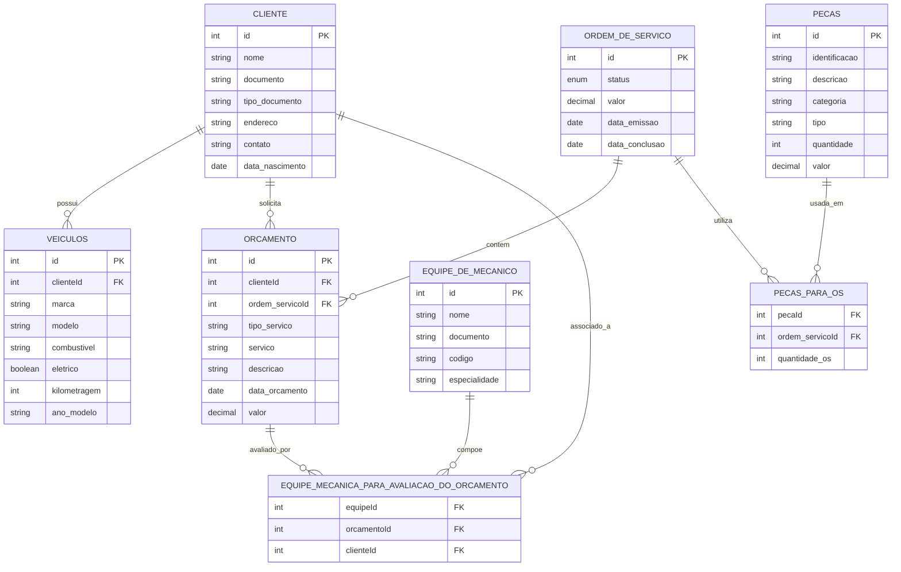

# 🛠️ Sistema de Controle e Gestão de Ordem de Serviço — Oficina

Este projeto implementa um sistema de banco de dados relacional para o gerenciamento de uma oficina mecânica, incluindo diagrama EER, estrutura SQL e queries para geração de relatórios detalhados sobre clientes, veículos, ordens de serviço, orçamento, mecânicos e peças.

***

## 🗄️ Estrutura do Banco de Dados

O banco segue boas práticas de modelagem relacional, com entidades normalizadas e integridade referencial garantida por chaves primárias (PK), estrangeiras (FK) e índices únicos. Todas as tabelas usam padrão de autoincremento para chaves primárias, exceto as tabelas de associação.

### Principais Entidades

- **Cliente**: Dados pessoais, contato, documento e endereço.
- **Veículos**: Relaciona veículos ao cliente, incluindo marca, modelo, combustível, elétrico e quilometragem.
- **Ordem_de_Serviço**: Registra status, valor, datas de emissão e conclusão.
- **Orçamento**: Detalha serviços orçados, valores, tipo do serviço e relaciona cliente e ordem.
- **Equipe_de_Mecânico**: Listagem de equipes, documentos, código e especialidades dos mecânicos.
- **Equipe_mecânica_para_avaliação_do_orçamento**: Associação entre mecânicos, orçamentos e clientes.
- **Peças**: Cadastro de peças, identificações, categorias, tipos, quantidade e valor.
- **Peças_para_OS**: Associação entre peças utilizadas e ordens de serviço com quantidade.

***

## 📊 Diagrama EER

O diagrama segue o modelo entidade-relacionamento estendido, representando relacionamentos (1:N e N:N), entidades, principais campos e constraints de integridade.

### Principais Relacionamentos

- Um cliente pode ter vários veículos.
- Um orçamento está vinculado a um cliente e a uma ordem de serviço.
- Uma ordem de serviço pode ter múltiplos orçamentos e múltiplas peças utilizadas.
- Equipes de mecânicos avaliam orçamentos de clientes.

***

## 📄 Diagrama

No repositório, encontra-se o arquivo **Diagrama ERR - BD Oficina.pdf**, que exibe o esquema Entidade-Relacionamento-Relacionamento (ERR) do banco de dados criado para este desafio.
Este diagrama ilustra visualmente as tabelas, chaves e relacionamentos fundamentais para o funcionamento do sistema de comércio eletrônico.
Para uma visualização rápida online, segue abaixo um diagrama simplificado em Mermaid.js:



***

## ⚙️ Scripts de Criação do Banco

Os scripts SQL criam todas as tabelas, vínculos (FOREIGN KEY), índices, enums e configuram a estrutura para garantir integridade dos dados. O padrão utilizado segue boas práticas com nomes descritivos e tipagem adequada para cada campo (INT, VARCHAR, ENUM, DATE, DECIMAL).

***

## 📋 Consultas SQL para Relatórios

O sistema oferece diversas queries para recuperação de dados essenciais:

### Relação de Serviços Realizados por Mecânico

Lista serviços realizados pelos mecânicos, incluindo especialidade, descrição, datas, valores e cliente relacionado:

```sql
SELECT
  em.Nome AS 'Mecânico',
  em.Especialidade,
  o.Servico AS 'Serviço',
  o.Tipo_de_servico AS 'Tipo de Serviço',
  o.Descricao AS 'Descrição',
  o.Data_orcamento AS 'Data do orçamento',
  o.Valor,
  c.Nome AS Cliente
FROM
  Equipe_de_mecanico em
  JOIN Equipe_mecanica_para_avaliacao_do_orcamento ema ON em.idEquipe_de_mecanico = ema.Equipe_de_mecanico_idEquipe_de_mecanico
  JOIN Orcamento o ON ema.Orcamento_idPedido = o.idPedido
  JOIN Cliente c ON o.Cliente_idCliente = c.idCliente
ORDER BY em.Nome, o.Data_orcamento;
```


***

### Relatório de Peças Utilizadas nas Ordens de Serviço

Lista peças utilizadas, status da OS, quantidade, identificação, descrição, categoria e tipo:

```sql
SELECT
  os.idOrdem_de_Servico as 'Ordem de Serviço',
  os.Status_da_OS as 'Status de Serviço',
  p.Identificacao as 'Produto',
  p.Descricao as 'Descrição',
  p.Categoria,
  p.Tipo,
  pp.Quantidade_OS
FROM
  Pecas p
  JOIN Pecas_para_OS pp ON p.idPecas = pp.Pecas_idPecas
  JOIN Ordem_de_Servico os ON pp.Ordem_de_Servico_idOrdem_de_Servico = os.idOrdem_de_Servico
ORDER BY pp.Quantidade_OS DESC;
```


***

### Relatório com Dados dos Clientes

Exibe dados gerais dos clientes e seus veículos (marca, modelo, ano/modelo, tipo de combustível, se é elétrico, quilometragem):

```sql
SELECT
  c.Nome,
  c.Documento,
  c.Tipo_documento AS 'Tipo de documento',
  c.Endereco AS 'Endereço',
  c.Contato,
  c.Data_nascimento AS 'Data de nascimento',
  v.Marca,
  v.Modelo,
  v.Ano_Modelo AS 'Ano/Modelo',
  v.Tipo_de_combustivel AS 'Tipo de combustível',
  CASE
    WHEN v.Eletrico = 1 THEN 'Sim'
    ELSE 'Não'
  END AS 'Elétrico?',
  v.Kilometragem
FROM
  Cliente c
  LEFT JOIN Veiculos v ON v.Cliente_idCliente = c.idCliente
ORDER BY c.Nome, v.Modelo;
```


***

### Relação de Veículos do Cliente com Serviços

Mostra veículos por cliente com serviços realizados, tipos, datas e valores dos orçamentos:

```sql
SELECT
  c.Nome AS Cliente,
  v.Marca,
  v.Modelo,
  v.Ano_Modelo AS 'Ano/Modelo',
  o.Servico AS 'Serviço',
  o.Tipo_de_servico AS 'Tipo de serviço',
  o.Data_orcamento AS 'Data do orçamento',
  o.Valor
FROM
  Cliente c
  JOIN Veiculos v ON c.idCliente = v.Cliente_idCliente
  LEFT JOIN Orcamento o ON o.Cliente_idCliente = c.idCliente
ORDER BY c.Nome, v.Modelo;
```


***

## 📝 Observações Finais

- O projeto está pronto para carregamento inicial de dados, estruturação dos vínculos e execução dos relatórios.
- As queries podem ser adaptadas conforme regras de negócio ou necessidades específicas de análise.
- A modelagem permite fácil expansão para novas funcionalidades ou campos.

